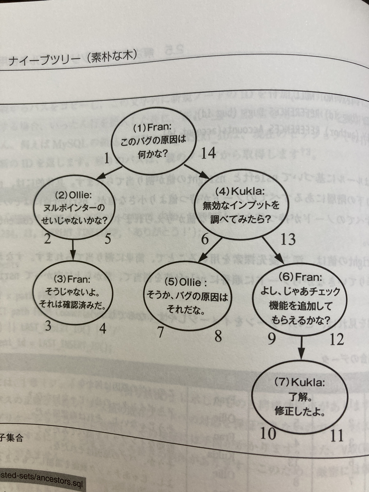
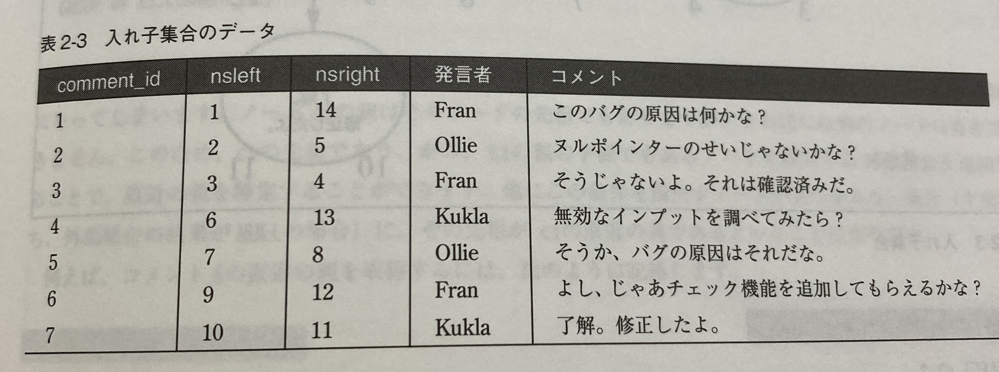
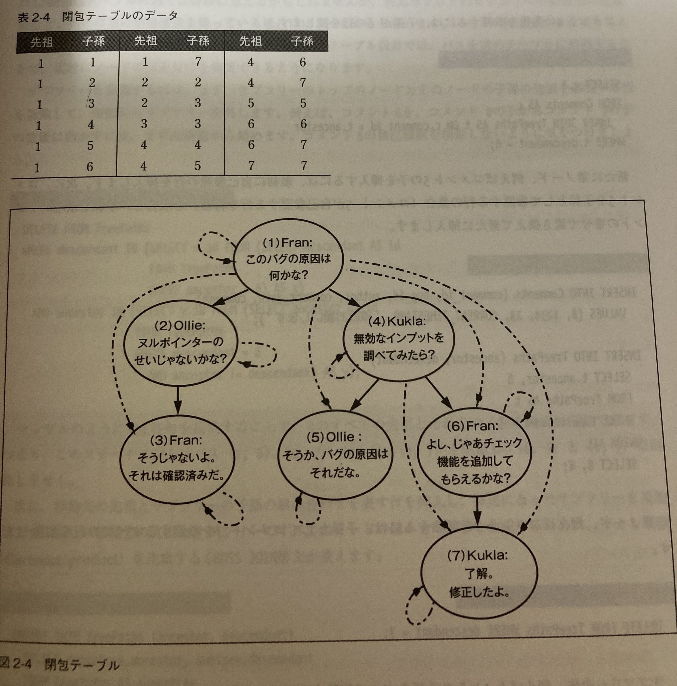
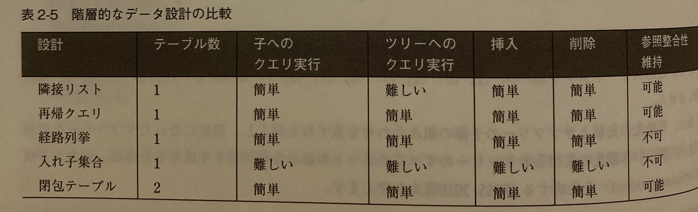

# 1章 ジェイウォーク（信号無視）

適切に交差テーブルを利用しないことで発生する。
交差テーブル（intersection）を無視するため、ジェイウォーク（信号無視）と名付けられた。

## 例

`product`テーブルにお問い合わせ用のアカウントの`account_id`を複数設定するために、
`account_id`を複数カンマ区切りで繋ぎ合わせて文字列として格納する。

```SQL
CREATE TABLE product (
    product_id SERIAL PRIMARY KEY
    account_id VARCHAR(100)
)
```

## 何がまずいか

- `account_id`を使った検索や結合に正規表現などによる工夫が必要になる。
- インデックスを効果的に利用できないのでパフォーマンスが落ちる。
- `account_id`に複数のアカウントIDを入れる場合にサイズ上限に引っかかる可能性がある
- 集約クエリ（SUM、COUNT、AVGなど）が使えなくなる
- アカウントIDの追加や削除、更新ではアプリ側での文字列操作が必要になる
- バリデーションがアプリ側で必要。全く関係のない"banana"のような文字列が入る危険性がある。

## アンチパターンを用いても良いかもしれない例

- カンマ区切りフォーマットのデータが必要で、各要素への個別アクセスが不要な時

## 解決策

交差テーブルの作成
```SQL
CREATE TABLE Contacts (
    product_id BIGINT UNSIGNED NOT NULL,
    account_id BIGINT UNSIGNED NOT NULL,
    PRIMARY KEY (product_id, account_id),
    FOREIGN KEY product_id REFERENCES products(product_id),
    FOREIGN KEY account_id REFERENCES accounts(account_id)
)
```
- より柔軟にクエリを発行できる。
- インデックスを効果的に利用できる。

# 2章 ナイーブな木（素朴な木）

## 目的

再帰的な関連をもつデータを管理したい。例えば、コメントに対するコメントを書く事ができるスレッド形式のコメント欄など。
他の例としては従業員の上下関係を表す組織図もあげられる。ここではスレッド形式のコメント欄を例として取り上げる。

## アンチパターン

常に親のみに依存してしまう。以下の例では各コメントは`parent_id`に親ノードのコメントの`comment_id`を格納している。
```SQL 
CREATE TABLE comments (
    comment_id SERIAL PRIMARY KEY,
    parent_id BIGINT UNSIGNED,
    comment TEXT NOT NULL,
    FOREIGN KEY (parent_id) REFERENCES Comments(comment_id)
)
```

## 何がまずいか

- サブツリーへのCOUNTやSUMといったクエリを打つのに同じクエリで複数のOUTER JOINを含むことになる。

```SQL
SELECT COUNT(*)
FROM comments AS c1
LEFT JOIN comments AS c2 ON c2.parent_id = c1.comment_id
LEFT JOIN comments AS c3 ON c3.parent_id = c2.comment_id
LEFT JOIN comments AS c4 ON c4.parent_id = c3.comment_id
LEFT JOIN comments AS c5 ON c5.parent_id = c4.comment_id
WHERE c1.comment_id = 1;
```

- 削除が難しくなる
  - 非葉ノードの削除では先にこのノードの`parent_id`を付け替える必要がある。
  - サブツリーの削除では複数回のSELECTクエリののち、（外部キー制約がある場合は）子孫のノードから消していく必要がある。

## アンチパターンを用いても良いかもしれない例

- ノードの直近の親と子を取得するだけで良い時
- 再帰クエリ構文が利用できる場合（MySQL8.0、PostgreSQL8.4など）
```SQL 
WITH RECURSIVE descendants AS (
    SELECT comment_id, parent_id, comment
    FROM comments
    WHERE parent_id = 1
    UNION ALL
    SELECT c.comment_id, c.parent_id, c.comment
    FROM comments c
    INNER JOIN descendants d ON c.parent_id = d.comment_id
)
SELECT *
FROM descendants;
```

## 解決策

代替ツリーモデルを検討すると良いだろう。
ここでは経路列挙モデル、入れ子集合モデル、閉包テーブルモデルの3つを紹介する。

### 経路列挙モデル

`path`カラムに経路を文字列で入れる方法である。`path`に入る値は`1/`や`1/2/`,`1/4/6/7`ど。
```SQL 
CREATE TABLE Comments (
  comment_id SERIAL PRIMARY KEY,
  path VARCHAR(1000)
)
```
コメント7の経路が`1/4/6/7`の時、その先祖を取得するには以下のようにする。
`%`は0文字以上の任意マッチのワイルドパターンである。||は文字列結合演算子。
```SQL 
SELECT *
FROM Comments AS c
WHERE '1/4/6/7' LIKE c.path || '%';
```
コメント4の経路が`1/4`の時、子孫を取得するには以下のクエリ
```SQL 
SELECT *
FROM Comments AS c
WHERE c.path LIKE '1/4/' || '%';
```
挿入の時は親のpathをコピーして追加する必要がある。

ジェイウォークと同様の弱点があることに注意する
- 中身の正確性を保証できない
- メンテナンスはアプリケーションコードに依存する
- VARCHARの長さに引っかかる可能性がある

### 入れ子集合（Nested Set）


入れ子集合は親ではなく子孫のidの範囲を保持する。この構造はほとんどノードの挿入や変更がない場合には有効。
```SQL 
CREATE TABLE Comments (
  comment_id SERIAL PRIMARY KEY,
  nsleft INTEGER NOT NULL,
  nsright INTEGER NOT NULL
)
```
コメント4とその子孫を取得する場合はコメント4の`nsleft`と`nsright`の間に、`nsleft`を含むノードすべてを検索すれば良い
```SQL 
SELECT c2.*
FROM Comments AS c1
  INNER JOIN Comments as c2
    ON c2.nsleft BETWEEN c1.nsleft AND c1.nsright
WHERE c1.comment_id = 4;
```
逆にコメント6の先祖を取得するにはコメント6の`nsleft`を、`nsleft`と`nsright`の間に含むノードを検索する。
```SQL 
SELECT c2.*
FROM Comments AS c1
  INNER JOIN Comments as c2
    ON c1.nsleft BETWEEN c2.nsleft AND c2.nsright
WHERE c1.comment_id = 6;
```
メリットとして、非葉ノードを削除した際に特に処理をすることなく子ノードを親ノードにつけることができる、深さの計算が容易である事が挙げられる。
一方で、隣接リストで簡単にできる隣接する親や子ノードの検索が複雑になったり、
ノードの挿入時に`nsleft`, `nsright`を書き換えてスペースを開けるといった複雑なことが必要になるというデメリットがある。

入れ子集合が適しているのは個々のノードの操作ではなく、サブツリーに対する迅速なクエリ実行が重要な場合と言える。

## 閉包テーブル（Closure Table）
閉包テーブルではCommentsテーブルに加えてTreePathsテーブルを新たに作り、ツリー全体のパスを格納する
```SQL 
CREATE TABLE TreePaths (
  ancester BIGINT UNSIGNED NOT NULL,
  descendant BIGINT UNSIGNED NOT NULL,
  PRIMARY KEY (ancester, descendant),
  FOREINGN KEY (ancester) REFERENCES Comments(comment_id),
  FOREIGN KEY (descendant) REFERENCES Comments(comment_id)
);
```
各行には先祖/子孫関係を共有するノードの組み合わせがすべて格納される。


先祖、子孫の列挙はかなり簡単。コメント4の子孫を探すには`ancester`に4が入っているものを探せば良い
```SQL 
SELECT c.*
FROM Comments AS c
  INNER JOIN TreePaths AS t ON c.comment_id = t.decendant
WHERE t.ancestor = 4;
```
先祖を探すには
```SQL 
SELECT c.*
FROM Comments AS c
  INNER JOIN TreePaths AS t ON c.comment_id = t.ancestor
WHERE t.decendant = 4;
```
挿入については親の祖先を列挙して、新たにインサート＆自己参照を作ればできる。ここではコメント5の下に8を入れている
```SQL 
INSERT INTO TreePaths (ancestor, descendant)
  SELECT t.ancestor, 8
  FROM TreePaths 
  WHERE t.descendant = 5
UNION ALL
  SELECT 8, 8;
```
葉ノードの削除には子孫として参照するすべての行を削除する（ここではコメント7を削除する）
```SQL 
DELETE FROM TreePaths WHERE descendant = 7;
```
サブツリーの削除は子孫を列挙してそのコメントと子孫を`descendant`に含む行をすべて消す
```SQL 
SELECT FROM TreePaths
WHERE descendant IN (
  SELECT x.id FROM (
    SELECT descendant AS id
    FROM TreePaths
    WHERE ancenster = 4
  ) AS x
);
```

メリットとしては、
- 設計がシンプル
- 先祖、祖先の列挙が迅速かつ容易
- 挿入や削除もできる。サブツリーの移動もできる（いまいち理解できてないので載せていないけど）
- 少し拡張して`path_length`をつけると直近の親や孫などを簡単に検索できるようになる
デメリットとしては、
- 別個のテーブルが必要
- 階層が多くなると多くの行数が必要となりスペースが消費される

閉包テーブルは最も用途が広い。



# とりあえずID（ID Required）

## 目的

目的はすべてのテーブルが主キーを持つ事である。どの列を主キーにするかは難しい問題で、メールアドレスですら厳密には一意であるとは限らない。
人工的な、意味を持たない値を格納し、主キーとする場合、その列は**擬似キー**と呼ばれる。

## アンチパターン: すべてのテーブルに「id」列を用いる

主キーを列名"id"ですべてのテーブルに作るのはアンチパターンである。例えば、こういうの
```SQL 
CREATE TABLE Bugs (
  id SERIAL PRIMARY KEY,
  description VARCHAR(1000),
  ...
```

## なんでダメなの？

- すでに主キーとして使えそうなキー（例えば`bug_id`）がある場合は冗長なキーになってしまう
- id列を主キーとしてしまうとその他のキーはUNIQUE制約がなければ重複する。交差テーブルなどで問題になりうる。
- "id"という名前は極めて一般的であるため、意味が分かりにくくなる。
  - 二つのテーブルをJOINしたSELECT文の時、PHPなどの言語では連想配列で結果が返されるので`b.id AS bug_id`みたいにする必要がある
- idという名前が被ってしまうとUSINGは利用できない。
  - USINGの例:  `SELECT * FROM Bugs INNER JOIN BugsProducts USING (bug_id)`

## アンチパターンを使用しても良い例

- ORMの規約によっては列名`id`で、整数の擬似キーを必要となる。こういう時は**設定より規約**に従う。
- 自然キーがあまりにも長い場合は良い選択肢になりうる。

## 解決策

- bugテーブルなら`bug_id`のように主キーに分かりやすい命名をする
- ORMの規約を上書きできるか調べる
- ユニークな自然キーがあればそれを主キーとする。仕様変更で重複するようになった場合は擬似キーを導入すれば良い。

# 4章 キーレスエントリ（外部キー嫌い）

## 目的

できるだけシンプルなアーキテクチャで参照整合性を持たせたい。

## アンチパターン: 外部キー制約を仕様しない

外部キーを省略するとデータベースがシンプルになり、柔軟性が高まり、実行速度が早くなると考えるエンジニアもいるが、代償があることに注意を払う必要がある。

## なぜダメなのか

- 完璧なコードを前提にしている。外部キー制約を利用しない場合はアプリ側で完璧なコードを書いて整合性を維持する必要がある。
- 破損を探すスクリプトの作成が必要になる（すべての参照に対して、以下のようなクエリを書く必要がある）
```SQL 
SELECT b.bug_id, b.status
FROM bugs b LEFT OUTER JOIN BugStatus s
  ON b.status = s.status
WHERE s.status IS NULL; 
```

## アンチパターンを用いても良い場合

- MySQLのMyISAMや、SQLiteの3.6.19以下のバージョンではそもそも外部キーがサポートされていない
- 極端に柔軟なデータベース設計を扱わなければならない場合

## 解決策

- 外部キー制約を使って参照整合性を維持することで「ポカヨケ」になる。
- カスケード更新を活用することで、親の行の更新、削除が可能になる
  - ON UPDATE RESTRICT は参照している親レコードが更新されようとした場合にエラーが発生する
  - ON UPDATE CASCADEは親テーブルのレコードの変更に追従して子のレコードも変更される
  - ON UPDATE SET NULLはNULLが入る
  - ※ ON DELETEもトリガーがDELETEになるだけでだいたい同じ感じ。ON DELETE CASCADEは子も消される

## 個人的補足

個人的には外部キー制約の利用は本当に参照整合性がないと大変なことになるという場合にのみ利用するべきと考えている。
例えばコメントとかであれば、ユーザが削除された場合に投稿者の名前を「退会済みのユーザ」と表示すれば良い。
きちんと理解しておかないとDBの変更や削除などで手間がかかったり、カスケード更新で意図しない変更が起きたりすると思うので、
なんでもかんでも外部キー制約をつけるというのはやめた方が良い。


